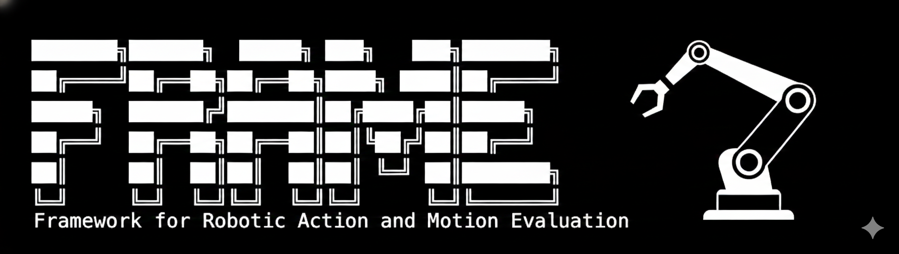

<p align="center">
  
</p>

<h1 align="center">FRAME: Marco de trabajo para la Evaluación de Acciones y Movimientos Robóticos</h1>

<p align="center">
  <a href="https://github.com/ameyawagh/robometric-frame/actions/workflows/ci.yml"></a>
  <a href="https://codecov.io/gh/ameyawagh/robometric-frame"></a>
  <a href="https://pypi.org/project/robometric-frame/"></a>
  <a href="https://openreview.net/forum?id=LS7IoE1ro5"></a>
  <a href="https://www.python.org/downloads/"></a>
  <a href="https://opensource.org/licenses/MIT"></a>
</p>

<p align="center">
  <em>Métricas de evaluación basadas en TorchMetrics para políticas robóticas y modelos de aprendizaje de robots.</em>
</p>

## Descripción general

`robometric-frame` proporciona un conjunto integral de métricas de evaluación diseñadas específicamente para políticas robóticas, incluidos controladores aprendidos, modelos de aprendizaje por imitación y agentes de aprendizaje por refuerzo. Construido sobre [TorchMetrics](https://torchmetrics.readthedocs.io/), ofrece:

- **Integración fácil**: Compatibilidad directa con PyTorch, PyTorch Lightning y Hugging Face
- **Entrenamiento distribuido**: Soporte nativo para entrenamiento multi-GPU/multi-nodo
- **Seguridad de tipos**: Anotaciones de tipos completas para un mejor soporte en IDEs
- **Bien probado**: Cobertura de pruebas exhaustiva
- **Extensible**: Fácil de ampliar con métricas personalizadas

## Instalación

```bash
# Using uv (recommended)
uv add robometric-frame

# Or using pip
pip install robometric-frame
```

### Instalar desde el código fuente

```bash
git clone https://github.com/ameyawagh/robometric-frame.git
cd robometric-frame

# Using uv
uv venv && source .venv/bin/activate
uv pip install -e .

# Or using pip
pip install -e .
```

## Inicio rápido

```python
import torch
from robometric_frame import SuccessRate, PathLength, ActionAccuracy

# Task Performance: Success Rate
metric = SuccessRate()
task_results = torch.tensor([1, 1, 0, 1, 0, 0, 1])
metric.update(task_results)
print(f"Success Rate: {metric.compute():.2%}")  # 57.14%

# Trajectory Quality: Path Length
metric = PathLength()
trajectory = torch.tensor([[0., 0.], [1., 0.], [1., 1.], [2., 1.]])
metric.update(trajectory)
print(f"Path Length: {metric.compute():.2f}")  # 3.00

# Task Performance: Action Accuracy
metric = ActionAccuracy()
predicted = torch.randn(10, 7)  # (timesteps, action_dim)
ground_truth = torch.randn(10, 7)
metric.update(predicted, ground_truth)
print(f"AMSE: {metric.compute():.4f}")
```

## Métricas disponibles

### Rendimiento de la tarea

- **SuccessRate** - Porcentaje de tareas completadas con éxito
- **TaskCompletionRate** - Completado de secuencias de tareas multinivel
- **ActionAccuracy** - MSE, AMSE, NAMSE para la precisión de la predicción de acciones

### Calidad de la trayectoria

- **PathLength** - Distancia total recorrida en una trayectoria
- **PathSmoothness** - Tasa de cambio en la dirección de la trayectoria
- **CurvatureChange** - Suavidad que considera la orientación del robot
- **AbsoluteTrajectoryError (ATE)** - Coherencia global de la trayectoria
- **RelativeTrajectoryError (RTE)** - Precisión local de la trayectoria

Consulte [docs/metrics.md](docs/metrics.md) para fórmulas y referencias detalladas.

## Características

### Soporte para entrenamiento distribuido

Todas las métricas admiten entrenamiento distribuido de forma nativa:

```python
import torch.distributed as dist
from robometric_frame import SuccessRate

# Automatically syncs across all processes
metric = SuccessRate()

# Each process updates with its local data
local_results = torch.tensor([1, 0, 1])
metric.update(local_results)

# Compute aggregates results from all processes
global_success_rate = metric.compute()
```

### Actualizaciones por lotes múltiples

Las métricas pueden actualizarse de forma incremental:

```python
metric = SuccessRate()

# Update with multiple batches
for batch in dataloader:
    results = evaluate_batch(batch)
    metric.update(results)

# Compute overall success rate
overall_sr = metric.compute()

# Reset for next epoch
metric.reset()
```

### Soporte para GPU

Las métricas funcionan de manera transparente en GPU:

```python
metric = SuccessRate().to("cuda")
success = torch.tensor([1, 1, 0, 1], device="cuda")
metric.update(success)
result = metric.compute()  # Result is on GPU
```

## Ejemplos de integración

### Bucle de entrenamiento con PyTorch

```python
from robometric_frame import SuccessRate

success_metric = SuccessRate()

for epoch in range(num_epochs):
    for batch in dataloader:
        predictions = model(batch)
        success = evaluate_tasks(predictions, batch.targets)
        success_metric.update(success)

    epoch_sr = success_metric.compute()
    print(f"Epoch {epoch} SR: {epoch_sr:.2%}")
    success_metric.reset()
```

### PyTorch Lightning

```python
import pytorch_lightning as pl
from robometric_frame import SuccessRate

class RobotPolicyModel(pl.LightningModule):
    def __init__(self):
        super().__init__()
        self.val_success_rate = SuccessRate()

    def validation_step(self, batch, batch_idx):
        predictions = self(batch)
        success = self.evaluate(predictions, batch)
        self.val_success_rate.update(success)

    def on_validation_epoch_end(self):
        sr = self.val_success_rate.compute()
        self.log("val_sr", sr)
```

### Transformadores de Hugging Face

```python
from transformers import Trainer
from robometric_frame import SuccessRate

def compute_metrics(eval_pred):
    predictions, labels = eval_pred
    metric = SuccessRate()
    metric.update(torch.tensor(predictions))
    return {"success_rate": metric.compute().item()}

trainer = Trainer(
    model=model,
    compute_metrics=compute_metrics,
)
```

## Desarrollo

### Configuración del entorno de desarrollo

```bash
# Clone repository
git clone https://github.com/ameyawagh/robometric-frame.git
cd robometric-frame

# Using uv (recommended - faster)
uv venv
source .venv/bin/activate
uv pip install -e ".[dev]"
pre-commit install

# Or using pip
python -m venv .venv
source .venv/bin/activate
pip install -e ".[dev]"
pre-commit install
```

Esto instala todas las dependencias de desarrollo (incluidas las herramientas de documentación) y configura los ganchos de git para verificaciones automáticas de calidad del código al confirmar.

### Ejecutar pruebas

```bash
# Run all tests
pytest

# Run with coverage
pytest --cov=robometric_frame --cov-report=html

# Run specific test file
pytest tests/test_success_rate.py -v
```

### Calidad del código

Los ganchos pre-commit ejecutan automáticamente verificaciones de calidad del código antes de cada confirmación:

```bash
# Run all pre-commit hooks manually
pre-commit run --all-files

# Run specific hooks
pre-commit run ruff --all-files         # Lint code
pre-commit run ruff-format --all-files  # Format code
pre-commit run mypy --all-files         # Type checking

# Or run individual tools directly
ruff check src/ tests/ examples/   # Lint
ruff format src/ tests/ examples/  # Format
mypy src/                          # Type check
```

**Qué se ejecuta al confirmar:**
- Formato de código (Ruff)
- Verificación de código (Ruff)
- Verificación de tipos (Mypy)
- Ordenación de importaciones (Ruff)
- Validación de YAML/TOML
- Eliminación de espacios en blanco al final

### Generación de documentación

El proyecto utiliza [Sphinx](https://www.sphinx-doc.org/) para generar la documentación de la API. Las dependencias de documentación se incluyen en los extras `[dev]`, por lo que no se necesita instalación adicional.

```bash
# Navigate to docs directory
cd docs

# Build HTML documentation
make html

# The generated documentation will be in docs/build/html/
# Open it in your browser
open build/html/index.html  # macOS
# xdg-open build/html/index.html  # Linux
# start build/html/index.html  # Windows
```

#### Servidor de documentación en vivo

Para desarrollo con recarga automática (reconstruye automáticamente cuando cambian los archivos):

```bash
cd docs
make livehtml

# Server starts at http://127.0.0.1:8000
# Press Ctrl+C to stop
```

#### Otros formatos de documentación

```bash
# Build PDF documentation (requires LaTeX)
make latexpdf

# Build EPUB documentation
make epub

# See all available formats
make help

# Clean previous builds
make clean
```

La documentación se genera automáticamente a partir de:
- Docstrings en el código fuente
- Archivos RST en `docs/source/`
- Anotaciones de tipos y firmas

## Contribuir

¡Las contribuciones son bienvenidas! Consulte [CONTRIBUTING.md](CONTRIBUTING.md) para obtener directrices sobre:
- Configuración de su entorno de desarrollo
- Estrategia de ramificación
- Requisitos de prueba
- Envío de solicitudes de extracción (pull requests)

## Licencia

Este proyecto está licenciado bajo la Licencia MIT - consulte el archivo [LICENSE](LICENSE) para obtener más detalles.

## Citación

Si utiliza esta biblioteca en su investigación, por favor cite:


```bibtex
@inproceedings{wagh2026frame,
  title = {{FRAME}: Framework for Robotic Action and Motion Evaluation},
  author = {Ameya Wagh and Vishnu Rudrasamudram},
  booktitle = {ICML 2026 Workshop on Combining Theory and Benchmarks: Towards A Virtuous Cycle to Understand and Guarantee Foundation Model Performance},
  year = {2026},
  url = {https://openreview.net/forum?id=LS7IoE1ro5}
}
```


## Referencias

Consulte [docs/metrics.md](docs/metrics.md) para referencias exhaustivas a artículos de investigación y metodologías.

## Agradecimientos

- Construido sobre [TorchMetrics](https://torchmetrics.readthedocs.io/)
- Inspirado en investigaciones robóticas, incluyendo RT-1, RT-2 y otros métodos de aprendizaje de robots
